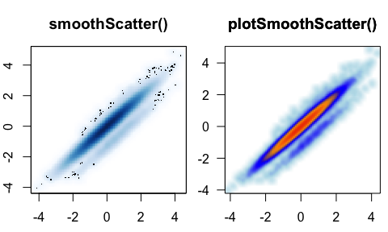
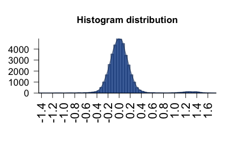
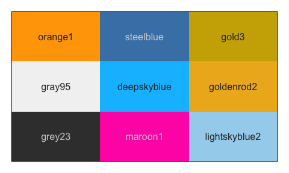
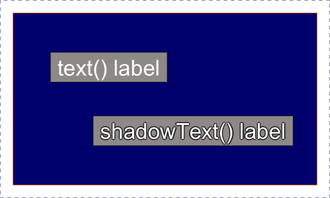
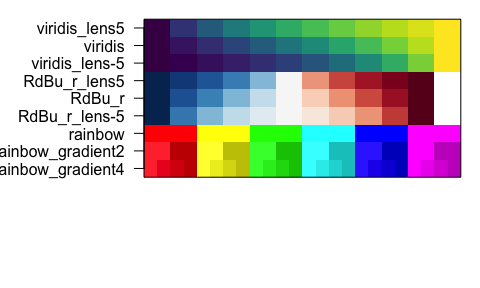

<!-- README.md is generated from README.Rmd. Please edit that file -->

# jamba

The goal of jamba is to provide useful custom functions for R data
analysis and visualization. jamba version **1.0.2**

## Package Reference

A full online function reference is available via the pkgdown
documentation:

[Full jamba command reference](https://jmw86069.github.io/jamba/)

Functions are categorized, some examples are listed below:

## Installation

Production will soon be available from CRAN:

`install.packages("jamba")`

The development version can be installed:

`remotes::install_github("jmw86069/jamba")`

### Additional R Packages in “Suggests”

- `crayon` - install with `install.packages("crayon")` for glorious
  colored console output. Color makes it better.
- `farver` - install with `install.packages("farver")` for more
  efficient color manipulations, and HSL color coneversions.

### Additional R Packages in “Enhances”

Bioconductor packages are invaluable for bioinformatics work, but can be
a bit “heavy” to install if not absolutely necessary. Therefore,
Bioconductor packages are in “Enhances” so they require someone to make
the choice to install them.

- `S4Vectors` - install with `BiocManager::install("S4vectors")` to
  improve speed of `cPaste()` functions.
- `openxlsx` - install with `install.packages("openxlsx")` to support
  Excel `xlsx` file import, and stylized export.
- `kableExtra` - install with `install.packages("kableExtra")` to enable
  colorized kable HTML tables in RMarkdown documents.
- `ComplexHeatmap` - install with
  `BiocManager::install("ComplexHeatmap")` to use with
  `heatmap_row_order()`, `cell_fun_label()` for custom labels.
- `matrixStats` - install with `install.packages("matrixStats")` for
  efficient `numeric` stats calculations, or `sparseMatrixStats` for use
  with Matrix sparse matrices as used with Seurat and
  SingleCellExperiment data.
- `ggridges` - install with `install.packages("ggridges")` for
  convenient ridge density plots using `plotRidges()`.

## Background

The R functions in `jamba` have been built up, used, tested, revised
over several years. They are immediately useful for day-to-day work, and
efficient and robust enough for production pipelines.

Many were inspired by discussion from Stackoverflow, R-help, or
Bioconductor, with citations thanking principal author(s). Many thanks
to the original authors! The R community is built upon the collective
greatness of its contributors!

Most of the functions are designed around workflows for Bioinformatics
analyses, where functions need to be efficient when operating over
10,000 to 100,000 elements. (They work quite well with millions as
well.) Usually the speed gains are obvious with about 100 elements, then
scale linearly (or worse) as the number increases. I and others use
these functions *all the time*.

One example function `writeOpenxlsx()` is a simple wrapper around very
useful `openxlsx::write.xlsx()`, which also applies column formatting
for column types: P-values, fold changes, log2 fold changes, numeric,
and integer values. Columns use conditional Excel formatting to apply
color-shading to cells for each type.

Similarly, `readOpenxlsx()` is a wrapper function to
`openxlsx::read.xlsx()` which reads each worksheet and returns a `list`
of `data.frame` objects. It can detect multi-row column headers, for
which it returns combined column names. It also applies equivalent of
`check.names=FALSE` so column names are returned without change.

Small and large efficiencies are used wherever possible. The
`mixedSort()` functions are based upon `gtools::mixedsort()`, with
additional optimizations for speed and custom needs. It sorts chromosome
names, gene names, micro-RNA names, etc.

## Alphanumeric sort

- `mixedSort()` - highly efficient alphanumeric sort, for example chr1,
  chr2, chr3, chr10, etc.
- `mixedSortDF()` - as above, applied to columns in a `data.frame` (or
  `matrix`, `tibble`, `DataFrame`, etc.)
- `mixedSorts()` - as above, applied to a list of vectors with no speed
  loss.

Example:

<div class="kable-table">

|     | miRNA   | sort_rank | mixedSort_rank |
|:----|:--------|----------:|---------------:|
| 2   | ABCA2   |         2 |              1 |
| 1   | ABCA12  |         1 |              2 |
| 3   | miR-1   |         3 |              3 |
| 6   | miR-1a  |         6 |              4 |
| 7   | miR-1b  |         7 |              5 |
| 8   | miR-2   |         8 |              6 |
| 4   | miR-12  |         4 |              7 |
| 9   | miR-22  |         9 |              8 |
| 5   | miR-122 |         5 |              9 |

</div>

## Base R plotting

These functions help with base R plots, in all those little cases when
the amazing `ggplot2` package is not a smooth fit.

- `nullPlot()` - convenient “blank” base R plot, optionally displays
  margins
- `plotSmoothScatter()` - smooth scatter `plot()` for point density,
  enhanced over `smoothScatter()`
  
- `plotPolygonDensity()` - fast density/histogram plot for vector or
  matrix
  
- `imageDefault()` - enhanced `image()` that enables raster output with
  consistent pixel aspect ratio.
- `imageByColors()` - wrapper to `image()` for a matrix or data.frame of
  colors, with optional labels
  
- `minorLogTicksAxis()`, `logFoldAxis()`, `pvalueAxis()` - log axis tick
  marks and labels, compatible with `offset` for example
  `log(offset + x)`.
- `sqrtAxis()` - draw a square-root transformed axis, with proper
  labels.
- `drawLabels()` - draw square colorized text labels
- `shadowText()` - replacement for `text()` that draws shadows or
  outlines.
  
- `groupedAxis()` - grouped axis labels to show regions/ranges
- `decideMfrow()` - determine appropriate value for `par("mfrow")` for
  multipanel output in base R plotting.
- `getPlotAspect()` - determine visible plot aspect ratio.

## Excel export

Every Bioinformatician/statistician needs to write data to Excel, the
`writeOpenxlsx()` function is consistent and makes it look pretty. You
can save numerous worksheets in a single Excel file, without having to
go back and custom-format everything.

- `writeOpenxlsx()` - flexible Excel exporter, with categorical and
  conditional colors.
- `applyXlsxCategoricalFormat()` - apply categorical colors to Excel
- `applyXlsxConditionalFormat()` - apply conditional colors to Excel

## Colors

Almost everything uses color somewhere, especially on R console, and in
every R plot.

- `getColorRamp()` - retrieve or create color palettes
- `setTextContrastColor()` - find contrasting font color for colored
  background
- `makeColorDarker()` - make a color darker (or lighter, or saturated)
- `color2gradient()` - split one color to a gradient of `n` colors
- `showColors()` - display a vector or `list` of colors
- `rainbow2()` - enhances `rainbow()` categorical colors for visual
  contrast.
- `warpRamp()` - “bend” a color gradient to enhance the visual range
- `fixYellow()` - opinionated reduction of yellow-green hue
- `printDebug()` - colorized text output to console or RMarkdown
- `printDebugHtml()` - colorized HTML output in RMarkdown or web pages
- `kable_coloring()` - colored `kableExtra::kable()` RMarkdown tables,
  if `kableExtra` package is installed.
- `col2alpha()`, `alpha2col()` - get or set alpha transparency
- `col2hcl()`, `col2hsl()`, `col2hsv()`, `hcl2col()`, `hsl2col()`,
  `hsv2col()`, `rgb2col()` - consistent color conversions.
- `color_dither()` - split color into two to make color stripes



## List Functions

Efficient methods to operate on lists in one call, to avoid looping
through the list either with `for()` loops, `lapply()` or `map()`
functions. Driven by speed with 10k-100k rows, typical biological
datasets.

Compared to convenient alternatives, `apply()` or tidyverse, typically
order of magnitude faster. (Ymmv.) Notable exceptions: `data.table` and
Bioconductor `S4Vectors`. Both are amazing, and are fairly heavy
installations. `S4Vectors` is used when available.

- `cPaste()` - `paste(..., collapse)` a list of vectors
- `cPasteS()` - `cPaste()` with `mixedSort()`
- `cPasteU()` - `cPaste()` with `unique()` (actually `uniques()`)
- `cPasteSU()` - `cPaste()` with `mixedSort()` and `unique()`
- `uniques()` - `unique()` across a list of vectors
- `sclass()` - `class()` a list
- `sdim()` - `dim()` across a list, or S4 object, or non-list object
- `ssdim()` - `sdim()` across a list
- `sdima()` - `sdim()` for `attributes()`
- `rbindList()` - `do.call(rbind, ...)` to bind rows into a `matrix` or
  `data.frame`, useful together with `strsplit()`.
- `mergeAllXY()` - `merge(..., all.x=TRUE, all.y=TRUE)` a list of
  `data.frame`
- `rmNULL()` - remove NULL from a list, with optional replacement
- `rmNAs()` - `rmNA()` across a list, with option replacement(s)
- `showColors()` - display colors
- `heads()` - `head()` across a list

## Unique names with versions

R object names provide an additional method to confirm data are kept in
the proper order. Duplicated names may be silently ignored, which
motivated the easy approach to “make unique names”.

- `makeNames()` - make unique names, with flexible rules
- `nameVector()` - add unique names using `makeNames()`
- `nameVectorN()` - make vector of names, named with `makeNames()`.
  Useful inside `lapply()` which returns names but only when provided.

## data.frame/matrix/tibble

- `mixedSortDF()` - `mixedSort()` by columns or rownames
- `pasteByRow()` - fast row-paste with delimiters, default skips blanks
- `pasteByRowOrdered()` - nifty alternative that honors factor levels
- `rowGroupMeans()`, `rowRmMadOutliers()` - grouped row functions
- `mergeAllXY()` - merge a list of `data.frame` into one, keeping all
  rows
- `renameColumn()` - rename columns `from` and `to`.
- `kable_coloring()` - flexible colorized `data.frame` output in
  Rmarkdown.

## String / grep

- `tcount()` - `table()` sorted high-to-low, with minimum count filter
- `middle()` - show `n` entries from start, middle, then end.
- `gsubOrdered()` - `gsub()` that returns ordered factor, inherits
  existing
- `gsubs()` - `gsub()` a vector of patterns/replacements.
- `grepls()` - grep the environment object names, including attached
  packages
- `vgrep()`, `vigrep()` - value-grep shortcut
- `unvgrep()`, `unvigrep()` - un-grep, remove matched results
- `provigrep()` - progressive grep, returns matches in order of patterns
- `igrepHas()` - case-insensitive grep-any
- `ucfirst()` - upper-case the first letter of each word.
- `padString()`, `padInteger()` - produce strings from numeric values
  with consistent leading zeros.

## Numeric

- `formatInt()` - opinionated `format()` for integers.
- `normScale()` - scale between 0 and 1 or custom range
- `noiseFloor()` - apply noise floor, ceiling, with flexible
  replacements
- `log2signed()`, `exp2signed()` - log2 with offset, and reciprocal
- `rowGroupMeans()`, `rowRmMadOutliers()` - efficient grouped row
  functions
- `deg2rad()`, `rad2deg()` - interconvert degrees and radians
- `rmNA()` - remove NA values, with optional replacement
- `warpAroundZero()` - warp a numeric vector symmetrically around zero
- `rmInfinite()` - remove infinite values, with optional replacement.
- `formatInt()` - convenient `format()` for integer output, with
  comma-delimiter by default

### Common usage

- convert zero to NA:

``` r
noiseFloor(0:10, minimum=1e-20, newValue=NA)
#>  [1] NA  1  2  3  4  5  6  7  8  9 10
```

- convert values below floor to floor:

``` r
noiseFloor(0:10, minimum=3)
#>  [1]  3  3  3  3  4  5  6  7  8  9 10
```

- convert values below floor or NA to floor:

``` r
noiseFloor(c(0:10, NA), minimum=3, adjustNA=TRUE)
#>  [1]  3  3  3  3  4  5  6  7  8  9 10  3
```

## Practical / helpful

- `jargs()` - pretty function arguments, optional pattern search
  argument name

``` r
jargs(plotSmoothScatter)
#>                 x = ,
#>                 y = NULL,
#>              bwpi = 50,
#>             binpi = 50,
#>        bandwidthN = NULL,
#>              nbin = NULL,
#>            expand = c(0.04, 0.04),
#>       transFactor = 0.25,
#>    transformation = function( x ) x^transFactor,
#>              xlim = NULL,
#>              ylim = NULL,
#>              xlab = NULL,
#>              ylab = NULL,
#>          nrpoints = 0,
#>           colramp = c("white", "lightblue", "blue", "orange", "orangered2"),
#>               col = "black",
#>            doTest = FALSE,
#>    fillBackground = TRUE,
#>          naAction = c("remove", "floor0", "floor1"),
#>              xaxt = "s",
#>              yaxt = "s",
#>               add = FALSE,
#>               asp = NULL,
#> applyRangeCeiling = TRUE,
#>         useRaster = TRUE,
#>           verbose = FALSE,
#>               ... =
```

- `sdim()`, `ssdim()` - dimensions of list objects, or nested list of
  lists
- `sdima()` - runs `sdim()` on the attributes of an object.
- `isTRUEV()`, `isFALSEV()` - vectorized test for TRUE or FALSE values,
  since `isTRUE()` only operates on single values, and does not allow
  `NA`.
- `reload_rmarkdown_cache()` - load RMarkdown cache folder into
  environment
- `call_fn_ellipsis()` - for developers, call child function while
  passing only acceptable arguments in `...`. Instead of:
  `something(x, ...)`, use: `call_fn_ellipsis(something, x, ...)` and
  never worry about `...`.
- `log2signed()`, `exp2signed()` - convenient `log2(1 + x)` or its
  reciprocal, using customizable offset.
- `newestFile()` - most recently modified file from a vector of files

### R console

- `jargs()` - Jam argument list - see “Practical” above for example
- `lldf()` - `ls()` with `object.size()` into `data.frame`
- `middle()` - Similar to `head()` and `tail()`, `middle()` shows `n`
  entries from beginning, middle, to end.
- `printDebug()` - colorized text output
- `setPrompt()` - colorized R console prompt with project name and R
  version

### RMarkdown

- `reload_rmarkdown_cache()` - when rendering RMarkdown with
  `cache=TRUE`, this function reads the cache to reload the environment
  without re-processing, to recover the exact result for continued work.

- `printDebugHtml()` - colored HTML output.

  - Shortcut for `printDebug(..., htmlOut=TRUE, comments=FALSE)`, or
    `options("jam.htmlOut"=TRUE, "jam.comment"=FALSE)`.
  - The RMarkdown chunk must include: `results='asis'`

``` r
printDebugHtml("printDebugHtml(): ",
  "Output is colorized: ",
  head(LETTERS, 8))
```

(<span style="color:#00C3C3FF">12:05:41</span>) 07Mar2025:
<span style="color:#FF7F00FF">printDebugHtml():
</span><span style="color:#1E90FFFF">Output is colorized:
</span><span style="color:#FF7F00FF">A,</span><span style="color:#ED983BFF">B,</span><span style="color:#FF7F00FF">C,</span><span style="color:#ED983BFF">D,</span><span style="color:#FF7F00FF">E,</span><span style="color:#ED983BFF">F,</span><span style="color:#FF7F00FF">G,</span><span style="color:#ED983BFF">H</span><br/>

``` r

withr::with_options(list(jam.htmlOut=TRUE, jam.comment=FALSE), {
  printDebugHtml(c("printDebug() using withr::with_options(): "),
    c("Output should be colorized: "),
    head(LETTERS, 8));
})
```

(<span style="color:#00C3C3FF">12:05:41</span>) 07Mar2025:
<span style="color:#FF7F00FF">printDebug() using withr::with_options():
</span><span style="color:#1E90FFFF">Output should be colorized:
</span><span style="color:#FF7F00FF">A,</span><span style="color:#ED983BFF">B,</span><span style="color:#FF7F00FF">C,</span><span style="color:#ED983BFF">D,</span><span style="color:#FF7F00FF">E,</span><span style="color:#ED983BFF">F,</span><span style="color:#FF7F00FF">G,</span><span style="color:#ED983BFF">H</span><br/>

- `kable_coloring()` - applies categorical colors to `kable()` output
  using `kableExtra::kable()`.

  - It also applies a contrasting text color.
  - Unfortunately, the HTML output is not compatible with this page on
    Github, see package function docs in RStudio.

``` r
expt_df <- data.frame(
  Sample_ID="",
  Treatment=rep(c("Vehicle", "Dex"), each=6),
  Genotype=rep(c("Wildtype", "Knockout"), each=3),
  Rep=paste0("rep", c(1:3)))
expt_df$Sample_ID <- pasteByRow(expt_df[, 2:4])

# define colors
colorSub <- c(Vehicle="palegoldenrod",
  Dex="navy",
  Wildtype="gold",
  Knockout="firebrick",
  nameVector(color2gradient("grey48", n=3, dex=10), rep("rep", 3), suffix=""),
  nameVector(
    color2gradient(n=3,
      c("goldenrod1", "indianred3", "royalblue3", "darkorchid4")),
    expt_df$Sample_ID))
kbl <- kable_coloring(
  expt_df,
  caption="Experiment design table showing categorical color assignment.",
  colorSub)
```

## Other related Jam packages

Jam Github R packages are being transitioned to CRAN/Bioconductor:

- `venndir`: Venn diagrams with direction, designed for published
  figures.
- `multienrichjam`: Multi-enrichment pathway analysis and visualization
  tools.
- `splicejam`: Sashimi plots for RNA-seq coverage and junction data.
- `jamma`: MA-plots as a unified ***data signal*** quality control
  toolset.
- `colorjam`: `rainbowJam()`, Categorical colors with improved visual
  contrast.
- `genejam`: Fast, structured approach to gene symbol integration.
- `platjam`: Platform specific functions: Nanostring, Salmon,
  Proteomics, Lipidomics; NGS coverage heatmaps.
- `jamses`: `heatmap_se()` friendly wrapper for ComplexHeatmap; other
  integrated methods for factor-aware design/contrasts, normalization,
  contrasts, heatmaps.
- `jamsession`: properly save/load R objects, R sessions, R functions.
