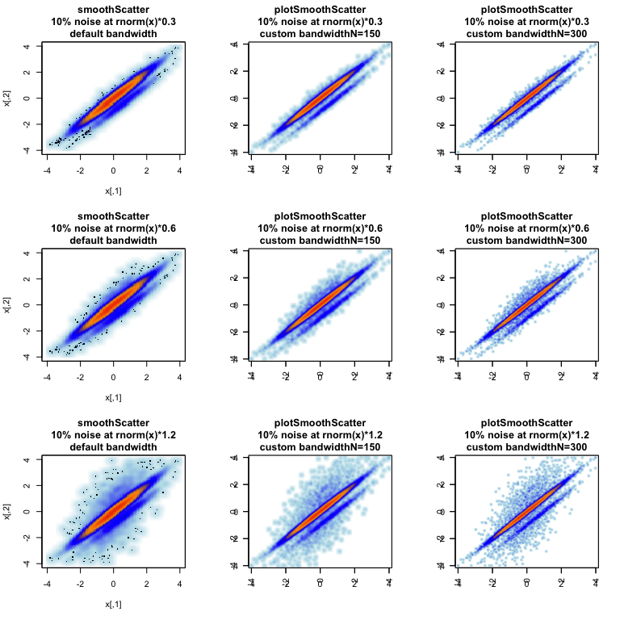

---
output:
  md_document:
    variant: markdown_github
---

<!-- README.md is generated from README.Rmd. Please edit that file -->


# jamba

The goal of jamba is to provide useful custom functions for R data
analysis and visualization.

A short overview of available methods:

* __plotSmoothScatter__: proper smooth scatter plot with fine detail.
* __imageDefault__: rasterized image plots. imageByColors: data.frame to image.
* __mixedSort__: efficient alphanumeric sort maintaining proper numeric order.
* __rbindList__: list to data.frame without padding empty cells.
* Also vectorized text styles, stackable color manipulations, vector names
  with versioning.

## plotSmoothScatter example

The plotSmoothScatter() function provides an alternative to the
base smoothScatter() function. It enhances the default bandwidth, which
increases visible detail in the image. It also enables the parameter
useRaster=TRUE which creates a rasterized image instead of using individual
polygons to display each pixel in the plot. The useRaster=TRUE parameter
can vastly decrease file space, memory requirements when opening the file,
and speed of creating and rendering figures.

The panels below compare the default smoothScatter() (left column) to
plotSmoothScatter() using two levels of bandwidth detail.


```r
plotSmoothScatter(doTest=TRUE);
```



## mixedSort example

The mixedSort() function is an optimization and extension of a similar
function in the gtools package, called gtools::mixedsort().
The function here has increased performance, and some ability to manage
positive and negative numbers embedded within a character string.


|sort    |mixedSort |
|:-------|:---------|
|miR-1   |miR-1     |
|miR-12  |miR-1a    |
|miR-122 |miR-1b    |
|miR-1a  |miR-2     |
|miR-1b  |miR-12    |
|miR-2   |miR-122   |

