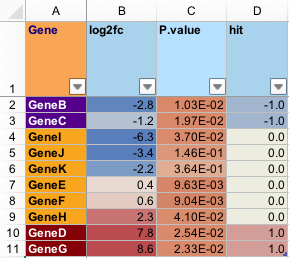

# Export a data.frame to 'Excel' 'xlsx' format

Export a data.frame to 'Excel' 'xlsx' format

## Usage

``` r
writeOpenxlsx(
  x,
  file = NULL,
  wb = NULL,
  sheetName = "Sheet1",
  startRow = 1,
  startCol = 1,
  append = FALSE,
  colorSub = NULL,
  headerColors = c("lightskyblue1", "lightskyblue2"),
  columnColors = c("aliceblue", "azure2"),
  highlightHeaderColors = c("tan1", "tan2"),
  highlightColors = c("moccasin", "navajowhite"),
  borderColor = "gray75",
  borderPosition = "BottomRight",
  numColumns = NULL,
  fcColumns = NULL,
  lfcColumns = NULL,
  hitColumns = NULL,
  intColumns = NULL,
  pvalueColumns = NULL,
  highlightColumns = NULL,
  numFormat = "#,##0.00",
  fcFormat = "#,##0.0",
  lfcFormat = "#,##0.0",
  hitFormat = "#,##0.0",
  intFormat = "#,##0",
  pvalueFormat = "[>0.01]0.00#;0.00E+00",
  numRule = c(1, 10, 20),
  fcRule = c(-6, 0, 6),
  lfcRule = c(-3, 0, 3),
  hitRule = c(-1.5, 0, 1.5),
  intRule = c(0, 100, 10000),
  pvalueRule = c(0, 0.01, 0.05),
  numStyle = c("#F2F0F7", "#B4B1D4", "#938EC2"),
  fcStyle = c("#4F81BD", "#EEECE1", "#C0504D"),
  lfcStyle = c("#4F81BD", "#EEECE1", "#C0504D"),
  hitStyle = c("#4F81BD", "#EEECE1", "#C0504D"),
  intStyle = c("#EEECE1", "#FDA560", "#F77F30"),
  pvalueStyle = c("#F77F30", "#FDC99B", "#EEECE1"),
  doConditional = TRUE,
  doCategorical = TRUE,
  freezePaneColumn = 0,
  freezePaneRow = 2,
  doFilter = TRUE,
  fontName = "Arial",
  fontSize = 12,
  minWidth = getOption("openxlsx.minWidth", 8),
  maxWidth = getOption("openxlsx.maxWidth", 40),
  autoWidth = TRUE,
  colWidths = NULL,
  wrapCells = FALSE,
  wrapHeaders = TRUE,
  headerRowMultiplier = 5,
  keepRownames = FALSE,
  verbose = FALSE,
  ...
)
```

## Arguments

- x:

  `data.frame` to be saved to an 'Excel' 'xlsx' file.

- file:

  `character` valid path to save an 'Excel' 'xlsx' file. If the file
  exists, and `append=TRUE` the new data will be added to the existing
  file using the defined `sheetName`.

  - Note When `file=NULL` the output is not saved to a file, instead the
    `Workbook` object is returned by this function. The `Workbook`
    object can be passed as argument `wb` in order to add multiple
    sheets to the same Workbook prior to saving them together in one
    final step. This pattern is recommended when saving multiple sheets
    together into one file, as it saves much time by avoiding repeated
    save/load steps.

- wb:

  `Workbook` object as defined in R package `openxlsx`, default NULL
  with `append=TRUE` will create a new workbook when `file` does not
  exist, or will load `file` when it exists. When provided `wb` it will
  be used as the input regardless of 'append'.

  This argument is intended to help build a workbook before saving the
  final result, which is more efficient for multi-sheet save operations
  by avoiding repeated save/load operations. When this argument is
  defined, data is not imported from `file`, and instead the workbook
  data is used from `wb`. This option is intended to improve speed of
  writing several sheets to the same output file, by preventing the slow
  read/write steps each time a new sheet is added.

- sheetName:

  `character` value less with a valid 'Excel' 'xlsx' worksheet name. At
  this time, June 2026, the 'sheetName' is restricted to 31 characters,
  with no punctuation permitted except for '-' and '\_'. It does permit
  spaces ' '.

- startRow, startCol:

  `integer` indicating the row and column number to start with the
  top,left cell written to the worksheet, defaults are 1.

- append:

  `logical` default FALSE, whether to append to file (TRUE), or to write
  over an existing file. The `append=TRUE` is useful when adding a
  worksheet to an existing file.

  **Document Colors:**

- colorSub:

  `character` vector of R colors, whose names refer to cell values in
  the input `x` data.frame.

- headerColors, columnColors, highlightHeaderColors, highlightColors,
  borderColor, borderPosition:

  default values for the 'Excel' worksheet background and border colors.
  As of version 0.0.29.900, colors must use valid 'Excel' color names.

  - Default values use alternating pale blue background in each column,
    changing to alternative tan background for highlighted columns. The
    default border is light grey (grey75) placed 'BottomRight'.

  **Column Type Assignment:**

- numColumns, fcColumns, lfcColumns, hitColumns, intColumns,
  pvalueColumns:

  `integer` vector referring the column number in the input `data.frame`
  `x` to define as each column type, as relevant.

- highlightColumns:

  `integer` vector with one or more columns to be highlighted.
  Highlighted columns use `highlightHeaderColors` and `highlightColors`
  for the header and cells, respectively, and apply bold font text by
  default.

  **Column Type Format:**

- numFormat, fcFormat, lfcFormat, hitFormat, intFormat, pvalueFormat:

  `character` string with valid 'Excel' cell formatting, for example
  `"#,##0.00"` defines a column to use comma-delimited numbers above one
  thousand, and display two decimal places in all numeric cells.

  - `IntFormat` default shows only integer values, even when the
    underlying Excel value contains decimal, fractional values.

  - `numFormat` default shows up to two decimal positions.

  - `fcFormat`, `lfcFormat`, `hitFormat` default show one decimal
    position.

  - `pvalueFormat` default shows the decimal value for values \> 0.01,
    and the exponent format for values below 0.01.

  See `[https://support.microsoft.com]` topic
  `"Excel Create and apply a custom number format."` or
  `"Excel Number format codes"` for more details. Some examples below:

  - `"#,##0"` : display only integer values, using comma as delimiter
    for every thousands place. The number `2142.12` would be
    represented: `"2,142"`

  - `"###0.0"` : display numeric values rounded to the `0.1` place,
    using no comma delimiter for values above one thousand. The number
    `2142.12` would be represented: `"2142.1"`

  - `"[>0.01]0.00#;0.00E+00"` : this rule is a conditional format,
    values above `0.01` are represented as numbers rounded to the
    thousandths position `0.001`; values below `0.01` are represented
    with scientific notation with three digits. The number `0.1256`
    would be represented: `"0.126"` The number `0.001256` would be
    represented: `"1.26E-03"`

  - `"[Red]#,###.00_);[Blue](#,###.00);[Black]0.00_)"` : this format
    applies to positive values, negative values, and zero, in order
    delimited by semicolons. Positive values are colored red. The string
    `"_)"` adds whitespace (defined by `"_"`) equale to the width of the
    character `")"` to the end of positive values. Negative values are
    surrounded by parentheses `"()"` and are colored blue. Values equal
    to zero are represented with two trailing digits, and whitespace
    (`"_"`) equal to width `")"`. The whitespace at the end of positive
    values and zero are used to align all values at the same decimal
    position.

  **Column Type Rules:**

- numRule, fcRule, lfcRule, hitRule, intRule, pvalueRule:

  `numeric` vector `length=3` indicating the breakpoints for 'Excel' to
  apply conditional color formatting, using the corresponding style.
  Note that all conditional formatting applied by this function uses the
  `"3-Color Scale"`, therefore there should be three values, and three
  corresponding colors in the corresponding Style arguments.

  - `numRule` default: 1, 10, 20

  - `fcRule` default: -6, 0, 6

  - `lfcRule` default: -3, 0, 3

  - `hitRule` default: -1.5, 0, 1.5

  - `intRule` default: 0, 100, 10000

  - `pvalueRule` default: 0, 0.01, 0.05

  **Column Type Styles:**

- numStyle, fcStyle, lfcStyle, intStyle, hitStyle, pvalueStyle:

  `character` vector length 3, containing three valid R colors, applied
  using `"3-Color Scale"` conditional formatting, together with the
  corresponding format, for example `numStyle` is applied to
  `numColumns` using `numRule`, then the cells are formatted with
  `numFormat`.

  - `fcStyle`, `lfcStyle`, `hitStyle` use blue-white-red divergent
    colors, expected to be centered at zero by `fcRule` for example.

  - `numStyle` uses a purple gradient inspired by RColorBrewer
    "Purples".

  - `intStyle` uses red-orange colors inspired by RColorBrewer "OrRd".

  - `pvalueStyle` uses red-orange colors, reversed so that significant
    values, beginning at 0.05 by default, become more red red.

  Alpha transparency is removed, as required.

  **Enable Conditional and Categorical Formatting:**

- doConditional:

  `logical` default TRUE, whether to apply conditional formatting. Note
  only the background cell color is affected, as well as contrasting
  text color.

- doCategorical:

  `logical` default TRUE, whether to apply categorical color formatting,
  only relevant when `colorSub` is defined. Note only the background
  cell color is affected, as well as contrasting text color.

  **Document Customization:**

- freezePaneColumn, freezePaneRow:

  `integer` value of the row or column before which the 'Excel' "freeze
  panes" is applied. Default `freezePaneColumn=0` will not maintain any
  columns. Default `freezePaneRow=2` will maintain the first row of
  column headers. Units are relative to the `data.frame` being saved,
  and will automatically be adjusted by `startRow` and `startCol` where
  applicable.

- doFilter:

  `logical` default TRUE, whether to enable column filtering by default.

- fontName:

  `character` font, default 'Arial', with a valid 'Excel' font name for
  the output document.

- fontSize:

  `numeric` default 12, font size in 'Excel' points.

- minWidth, maxWidth:

  `numeric` minimum, maximum size, defaults 8 and 30, respectively, and
  which uses [`options()`](https://rdrr.io/r/base/options.html)
  'openxlsx.minWidth' and 'openxlsx.maxWidth' when defined. Units are
  character units as defined by 'Excel', and are used when
  `autoWidth=TRUE` as default, to restrict cell widths. Argument
  `colWidths` is usually preferred, where possible.

- autoWidth:

  `logical` default TRUE, whether to permit Excel to attempt automatic
  column widths, within `minWidth` `maxWidth` widths. Excel has a
  tendency to set the column width based upon column values, and not the
  column header, therefore `colWidths` is recommended.

- colWidths:

  `numeric` width of each column in `x`, recycled to the total number of
  columns required. Default NULL does not apply specific widths, instead
  Excel will attempt default widths. When `keepRownames=TRUE`, the first
  column contains `rownames(x)`, therefore the length of expected
  `colWidths` is `ncol(x) + 1`.

- wrapCells:

  `logical` default FALSE, whether to word-wrap within cells. The
  default FALSE is effective when used together with specific
  `colWidths`.

- wrapHeaders:

  `logical` default TRUE, whether to enable word wrap for column
  headers, which is helpful when `autoWidth=TRUE` since it fixed the
  cell width while allowing the column header to be seen.

- headerRowMultiplier:

  `numeric` default 5, the row height of the first header row in
  'Excel'. This value is defined as a multiple of subsequent rows, and
  should usually represent the maximum number of lines after
  word-wrapping, as relevant. This argument is helpful when
  `wrapHeaders=TRUE` and `autoWidth=TRUE`.

- keepRownames:

  `logical` default FALSE, whether to include `rownames(x)` in its own
  column in 'Excel'.

- verbose:

  `logical` indicating whether to print verbose output.

- ...:

  additional arguments are passed to
  [`applyXlsxConditionalFormat()`](https://jmw86069.github.io/jamba/reference/applyXlsxConditionalFormat.md)
  and
  [`applyXlsxCategoricalFormat()`](https://jmw86069.github.io/jamba/reference/applyXlsxCategoricalFormat.md)
  as relevant.

## Value

`Workbook` object as defined by the `openxlsx` package is returned
invisibly with [`invisible()`](https://rdrr.io/r/base/invisible.html).
This `Workbook` can be used in argument `wb` to provide a speed boost
when saving multiple sheets to the same file.

## Details

This function is a minor but useful customization of the
[`openxlsx::saveWorkbook()`](https://rdrr.io/pkg/openxlsx/man/saveWorkbook.html)
and associated functions, intended to provide some pre-configured
formatting of known column types, typically relevant to statistical
values, and in some cases, gene or transcript expression values.

**Important Note:** Within 'Microsoft Excel', it stores the complete
numeric value, and simply displays that value with any customized format
as defined. When using 'Microsoft Excel' to export to a text file, it
will apply this visible formatting during that step, which may cause
some information to be lost.

There are numerous configurable options when saving an 'Excel'
worksheet, most of the defaults in this function are intended not to
require changes, but are listed as formal function arguments to make
each option visibly obvious.

If `colorSub` is supplied as a named vector of colors, then by default
text values will be colorized accordingly, which can be especially
helpful when including data with categorical text values.

Conditional formatting is applied to several recognized types of data
types, defined by `numColumns`, `intColumns`, `fcColumns`, `lfcColumns`,
`pvalueColumns`, `hitColumns`.

Conditional formatting is much more efficient than applying specific
colors to each cell in a large worksheet, for example if using a color
`function` to assign colors to `numeric` values, it would need to be
applied as individual color styles, and each unique style is stored as
such in the Excel workbook. A column with 12,000 distinct numeric values
may therefore contain hundreds or thousands of individual cell style
definitions, which is very inefficient for an Excel workbook.

This function pre-configures formatting options for the following column
data types, each of which has conditional color-formatting, defined
numeric ranges, and color scales.

- int:

  integer values, where numeric values are formatted without visible
  decimal places, and the `big.mark=","` standard is used to help
  visually distinguish large integers. The color scale is by default
  c(0, 100, 10000).

- num:

  numeric values, with fixed number of visible decimal places, which
  helps visibly align values along each row.

- hit:

  numeric type, a subset of "int" intended when data is flagged with
  something like a "+1" or "-1" to indicate a statistical increase or
  decrease.

- pvalue:

  P-value, where numeric values range from 1 down near zero, and values
  are formatted consistently with scientific notation.

- fc:

  numeric fold change, whose values are expected to range from 1 and
  higher, and -1 and lower. Decimal places are by default configured to
  show one decimal place, to simplify the 'Excel' visual summary.

- lfc:

  numeric log fold change, whose values are expected to be centered at
  zero. Decimal places are by default configured to show one decimal
  place, to simplify the 'Excel' visual summary.

- highlight:

  character and undefined columns to be highlighted with a brighter
  background color, and bold text.

For each column data type, a color scale and default numeric range is
defined, which allows conditional formatting of cells based upon
expected ranges of values.

A screenshot of the file produced by the example is shown below.



## See also

Other jam export functions:
[`applyXlsxCategoricalFormat()`](https://jmw86069.github.io/jamba/reference/applyXlsxCategoricalFormat.md),
[`applyXlsxConditionalFormat()`](https://jmw86069.github.io/jamba/reference/applyXlsxConditionalFormat.md),
[`readOpenxlsx()`](https://jmw86069.github.io/jamba/reference/readOpenxlsx.md),
[`set_xlsx_colwidths()`](https://jmw86069.github.io/jamba/reference/set_xlsx_colwidths.md),
[`set_xlsx_rowheights()`](https://jmw86069.github.io/jamba/reference/set_xlsx_rowheights.md)

## Examples

``` r
# set up a test data.frame
set.seed(123);
lfc <- -3:3 + stats::rnorm(7)/3;
colorSub <- nameVector(
   rainbow2(7),
   LETTERS[1:7])
df <- data.frame(name=LETTERS[1:7],
   int=round(4^(1:7)),
   num=(1:7)*4-2 + stats::rnorm(7),
   fold=2^abs(lfc)*sign(lfc),
   lfc=lfc,
   pvalue=10^(-1:-7 + stats::rnorm(7)),
   hit=sample(c(-1,0,0,1,1), replace=TRUE, size=7));
df;
#>   name   int        num      fold        lfc       pvalue hit
#> 1    A     4  0.7349388 -9.106049 -3.1868252 2.780730e-02   0
#> 2    B    16  5.3131471 -4.218488 -2.0767258 6.122279e-01   1
#> 3    C    64  9.5543380 -1.395160 -0.4804306 3.146665e-03  -1
#> 4    D   256 15.2240818  1.016424  0.0235028 1.079898e-06  -1
#> 5    E  1024 18.3598138  2.060645  1.0430959 5.027544e-05   0
#> 6    F  4096 22.4007715  5.945047  2.5716883 3.366732e-07   0
#> 7    G 16384 26.1106827  8.898972  3.1536387 8.554139e-09   1
# write to tempfile for examples
if (FALSE) { # \dontrun{
   out_xlsx <- tempfile(pattern="writeOpenxlsx_", fileext=".xlsx")
   writeOpenxlsx(x=df,
      file=out_xlsx,
      sheetName="jamba_test",
      colorSub=colorSub,
      intColumns=2,
      numColumns=3,
      fcColumns=4,
      lfcColumns=5,
      pvalueColumns=6,
      hitColumn=7,
      freezePaneRow=2,
      freezePaneColumn=2,
      append=FALSE);
   # now read it back
   df_list <- readOpenxlsx(xlsx=out_xlsx);
   sdim(df_list)
} # }
```
