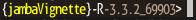

```{r, echo=FALSE}
knitr::opts_chunk$set(
  collapse=TRUE,
  warning=FALSE,
  message=FALSE,
  fig.height=8, fig.width=8,
  comment="#>",
  fig.path="jambaVignette-"
);
library(jamba);
```

# Jamba Overview

Jamba is intended to contain JAM base functions, to be re-used during
analysis, and by other R packages. Functions are broadly divided into
categories.

## Efficient alphanumeric sort

The `mixedSort()`, `mixedSortDF()` functions are designed for "genes",
"chromosomes", and "versions", with alphanumeric sorting.
For example:
* gene `"ACTA2"` before `"ACTA10"`
* micro-RNA `"hsa-miR-21"` before `"hsa-miR-100"`
* chromosome `"chr2"` before `"chr10"`

It is fast enough for most large dataset operations,
not unreasonably slower than `base::sort()`,
and much faster than alternative approaches.

* `mixedSort()` - alphanumeric sort.
* `mixedSortDF()` - sort `data.frame` (`tibble`, `matrix`, `DataFrame`, etc.)
* `mixedSorts()` - sort `list` of vectors, vectorized for speed boost.

Example:

```{r, mixedSort, echo=FALSE}
x <- sort(c(
  "miR-12","miR-1","miR-122","miR-1b",
  "miR-1a","miR-2", "miR-22",
  "ABCA2", "ABCA12"));
df1 <- data.frame(
  miRNA=x,
  sort_rank=seq_along(x),
  mixedSort_rank=order(jamba::mixedOrder(x)),
  check.names=FALSE,
  stringsAsFactors=FALSE);
df2 <- jamba::mixedSortDF(df1);
df2;
```


## Plot functions

### `plotSmoothScatter()`

A common problem when visualizing extremely large datasets is how to
display thousands of datapoints while indicating the amount of overlap
of those points. The "overplotting" problem.

The R `graphics::smoothScatter()` function provides an
adequate drop-in replacement for most uses of `plot()`, and
`plotSmoothScatter()` applies some enhanced defaults.

* Bandwidth is increased to provide more visual detail.
* Bins are increased to render higher resolution.
* Output is rasterized to improve speed and visual quality.
* Color ramp uses two-scale colors to distinguish low/high density.
* It calculates 2D density with independent x-/y-axis ranges,
without affecting the 2D density estimate. It means the density is
spherical and not oblong, when x-/y-axis range differ substantially.

The customizations use "bin" to define the bin size, and "bw"
to define the 2D kernel density bandwidth. The bandwidth defines
the detail of the "carpet", the point landscape if you will.
The bin size defines how many pixels are used to render this carpet.
Typically the bin size is related to the graphics device resolution.
However, bandwidth should be related to relative detail in the data.

Adjustments are easiest with arguments:
* `binpi` - bins per inch
* `bwpi` bandwidth per inch

Running `plotSmoothScatter()` with `doTest=TRUE` produces
some visual comparison with default `smoothScatter()`.

```{r plotSmoothScatter, fig.show='hold', fig.alt="Example of smooth scatterplots using the default R function, and enhanced function in the jamba package."}
plotSmoothScatter(doTest=TRUE);
```

### `imageByColors()`

The `imageByColors()` function is intended to take a matrix or data.frame
that already contains colors in each cell. It optionally displays cell
labels when supplied.

Cell labels are grouped to display one unique label per repeated label,
using the function `breaksByVector()` to group labels.

This function is particularly useful to simplify labels in a large
table of repeated values, for example in experiment design.

Here, we define a simple data.frame composed of colors, then use
the data.frame to label itself:

```{r imageByColors1, fig.show='hold', fig.alt="Example color matrix as plotted using the image by colors function()"}
a1 <- c("red","blue")[c(1,1,2)];
b1 <- c("yellow","orange")[c(1,2,2)];
c1 <- c("purple","orange")[c(1,2,2)];
d1 <- c("purple","green")[c(1,2,2)];
df1 <- data.frame(a=a1, b=b1, c=c1, d=d1);
imageByColors(df1, cellnote=df1);
```

Labels can be independently rotated and resized, an
arbitrary example is shown below:

```{r imageByColors2, fig.show='hold', fig.alt="Example color matrix with rotated and grouped labels as plotted using the image by colors function."}
imageByColors(df1,
   cellnote=df1, 
   useRaster=TRUE,
   #adjBy="column",
   cexCellnote=list(c(1.5,1.5,1),
      c(1,1.5), 
      c(1.6,1.2), 
      c(1.6,1.5)),
   srtCellnote=list(c(90,0,0), 
      c(0,45), 
      c(0,0,0), 
      c(0,90,0)));
```

### Axis label functions

There are several useful axis labeling functions.

For log-transformed data, `minorLogTicksAxis()` is a
flexible function to help deal with different transforms.
It enables "offset", commonly used with `log2(1 + x)`,
but now enables using any offset, e.g. `log2(0.5 + x)`.
Axis labels use integer values, accounting for the offset.

The `logBase` can be customized, can be properly labeled when showing
`log10(P-value)`. When showing log2 fold changes, it accepts
negative values and flips the sign accordingly.

```{r, log_ticks_1, fig.show='hold', fig.alt="Example showing log tick axis labels with positive and negative values, and P-values."}
# example showing volcano plot features
set.seed(123);
n <- 1000;
vdf <- data.frame(lfc=rnorm(n) * 2)
vdf$`-log10 (padj)` <- abs(vdf$lfc) * abs(rnorm(n))
plotSmoothScatter(vdf, xaxt="n", yaxt="n", xlab="Fold change",
   main="Volcano plot\ndisplayBase=2")
logFoldAxis(1)
pvalueAxis(2)

```

### `plotPolygonDensity()`

`plotPolygonDensity()` is a light wrapper
around two functions: `hist()` and `density()`. However, it
makes two other options convenient:

* Transform the x-axis with either `log10(1 + x)` or `sqrt()`, use
`xScale=c("default", "log10", "sqrt")`.
* Display multiple panels for each column of a numeric matrix.
* See also: `plotRidges()` - a ggridges alternative.

```{r, plot_dens_log, fig.show='hold', fig.alt="Example polygon density plot."}
withr::with_par(list("mar"=c(6, 4, 4, 2), "mfrow"=c(2, 2)), {
   withr::local_options(list("scipen"=7));
set.seed(123);
plotPolygonDensity(10^(3+rnorm(2000)),
   breaks=50,
   cex.axis=1,
   main="normal-scaled x-axis");
plotPolygonDensity(10^(3+rnorm(2000)),
   log="x",
   breaks=50,
   main="log-scaled x-axis");
plotPolygonDensity((3+rnorm(2000))^2,
   cex.axis=1,
   breaks=50,
   main="normal-scaled x-axis");
plotPolygonDensity((3+rnorm(2000))^2,
   cex.axis=1,
   xScale="sqrt",
   breaks=50,
   main="");
drawLabels(preset="topright",
   txt="sqrt-scaled x-axis",
   labelCex=1.5)
})
```

### `drawLabels()`

`drawLabels()` is aimed at base R graphics, and provides a quick
way to add a label to a plot. The argument `preset` is used to
place the label relative to the sides and corners of the plot.

Shown below `text_fn=jamba::shadowText` will enable shadow text output.

```{r, draw_labels, fig.show='hold', fig.alt="Example showing text labels, and shadow text labels on a colored background."}
par("mfrow"=c(1,1))
plotPolygonDensity((3+rnorm(2000))^2,
   cex.axis=1,
   xScale="sqrt",
   breaks=50,
   main="");
drawLabels(preset="bottom",
   txt="sqrt-scaled x-axis",
   text_fn=jamba::shadowText,
   labelCex=1.5)
```

## Colors

For me, color plays a big role in my daily work,
both in how I use R, and the figures and visualizations
I produce during data analysis.

Another Jam package `colorjam` focuses on defining
categorical colors in an extensible manner.

### `getColorRamp()`

* `getColorRamp()` is a workhorse of several other functions
and workflows.

   * It makes convenient the job of
   obtaining a color ramp (aka a color palette, or color
   gradient). It interfaces with `RColorBrewer` and `viridisLite`
   for color palette names, and allows some useful extensions.
   * It accepts suffix `"_r"` to reverse color order,
   `RColorBrewer` palette `"RdBu"` is reversed with `"RdBu_r"`.
   Red should be the high color in a heatmap - "heat",
   so "RdBu_r" is recommended.

### `printDebug()`

* `printDebug()` is present in every Jam function, used when `verbose=TRUE`
to follow the processing steps. Of course it uses color.
* `printDebugHtml()` is used for RMarkdown output, use the chunk option
`results='asis'` so the HTML is displayed properly.
* `printDebugI()` is an alternative that "inverts" the color, using the
color as background, with contrasting text color on top.

* When a vector is provided, its values are delimited with `sep`,
and each value is "dithered" with the same color with lighter/darker
pattern for visual distinction.
* Each element is assigned a color recycled from `fgText`, and
can be customized.

```{r printdebug, results='asis'}
printDebugHtml("printDebugHtml(): ",
  "Output is colorized: ",
  head(LETTERS, 8))

withr::with_options(list(jam.htmlOut=TRUE, jam.comment=FALSE), {
  printDebugHtml(c("printDebug() using withr::with_options(): "),
    c("Output should be colorized: "),
    head(LETTERS, 8));
})
```


### `showColors()`

* `showColors()` displays a color ramp, or `list` of color ramps,
or a `function` as defined by `circlize::colorRamp2()`. (Amazing
function by the way.)

### Other color functions

* `warpRamp()` is used with argument `lens` in other functions,
and can warp the colors for more contrast. It even handles divergent
colors, keeping the middle color intact.

* `rainbow2()` is a very simple drop-in replacement for `rainbow()`,
which adds alternating contrast to adjacent colors. A better option
is `colorjam::rainbowJam()` but `rainbow2()` is a simple option until
colorjam is on CRAN.

```{r, get_color_ramp, fig.show='hold', fig.alt="Example of color gradients using the Brewer package."}
showColors(list(
   Reds=getColorRamp("Reds"),
   RdBu=getColorRamp("RdBu"),
   RdBu_r=getColorRamp("RdBu_r"),
   `RdBu_r, lens=5`=warpRamp(getColorRamp("RdBu_r"), lens=5),
   `RdBu_r, lens=-5`=warpRamp(getColorRamp("RdBu_r"), lens=-5),
   `rainbow2(15)`=rainbow2(15)
   ));
```

## Console functions

### `setPrompt()`

`setPrompt()` is a convenience function for R console and RStudio work,
it creates a colorized R prompt with useful info:
* project name
* R version
* Process ID (PID). The PID is useful in case *ahem* the R session
runs wild.

Ultimately, it helps answer the question "What am I working on?"

```{r setPrompt, echo=TRUE}
setPrompt("jambaVignette");
# {jambaVignette}-R-3.6.0_10789>
```



### `jargs()`

Jam `args()`.

* Aligns arguments, one per row
* Allows pattern search
* Optionally sorts by argument name
* Colorized in the R console

```{r, jargs, message=TRUE}
# all args
jargs(plotSmoothScatter)

# args with "y" in the name
jargs(plotSmoothScatter, "^y")

```


### `sdim()` and `ssdim()`

These functions apply `dim()` to a list, or
list of lists. They recognize other S4 object types,
and special types like `igraph` and Bioconductor objects.

It returns either `data.frame` of dimensions, or `list` of `data.frame`,
which can be easily parsed and reviewed.

```{r, sdim}
L <- list(LETTERS=LETTERS,
   letters=letters,
   lettersDF=data.frame(LETTERS, letters));
sdim(L);

L2 <- list(List1=L,
   List2=L);

sdim(L2);
ssdim(L2)
```


## Excel functions

### `writeOpenxlsx()`

`writeOpenxlsx()` is a convenient wrapper for the amazing `openxlsx`,
to automate numeric formatting, column color, font size, text alignment.
When saving to Excel, you want all the details to look pretty, and
to be usable without having to configure it later.

It has presets for certain data types, with default numeric formatting,
and conditional color-coding by default:
* P-values
* fold change, log fold change
* numeric values
* integer values
* highlight columns (bold font)

It configures some defaults:
* column headers have filtering enabled
* striped column and header colors
* freeze pane and row to keep the header visible
* column widths
* word wrap, or not
* header row height
* categorical colors when defined

Some nice extras:
* save one or more worksheets to the same file
* optionally include rownames

### `readOpenxlsx()`

`readOpenxlsx()` is convenient for reading all worksheets in an
Excel file, and returns data without mangling the column headers.
It returns a `list` of `data.frame` objects.

## Convenience

### `vigrep()`, `provigrep()`, `igrep()`, `igrepHas()`

Quick custom `base::grep()` for case-insensitive, or value-returning work.

* `vigrep()` - extends grep to use `value=TRUE` and `ignore.case=TRUE`
* `igrep()` - extends grep to use `ignore.case=TRUE`, case-insensitive
matching.
* `provigrep()` - progressive pattern matching, returning entries in
the order they match a vector of patterns. Super useful.
* `igrepHas()` - extends `igrep()` to return `TRUE` or `FALSE`,
convenient for `if()` statements.

### `gsubOrdered()`

`gsubOrdered()` is an extension to `gsub()` that preserves
factor order of the input data, creating new ordered factor
levels using the same `gsub()` replacement. Much more useful
than you might think!


### `pasteByRow()` and `pasteByRowOrdered()`

`pasteByRow()` is a lightweight by efficient method
for combining multiple columns into one character string.
There are other approaches, however this function is among
the fastest, especially 10000 rows or more, and allows "ignoring"
empty cells in the output, and trimming leading/trailing blanks.

`pasteByRowOrdered()` is an extension of `pasteByRow()`
that also maintains factor level order of each column.
Again, super useful to make labels that honor factor level
order, for example with experimental designs.

```{r, paste_order}
a1 <- factor(c("mutant", "control")[c(1,1,2)],
   levels=c("control", "mutant"));
b1 <- factor(c("vehicle", "treated")[c(2,1,1)],
   levels=c("vehicle", "treated"));
d1 <- c("purple","green")[c(1,2,2)];
df2 <- data.frame(a=a1, b=b1, d=d1);
df2;
pasteByRow(df2);
pasteByRowOrdered(df2);

df3 <- data.frame(df2,
   pasteByRowOrdered=pasteByRowOrdered(df2));
mixedSortDF(df3, byCols="pasteByRowOrdered")

```

### `makeNames()`, `nameVector()`, `nameVectorN()`

Create unique names with controlled versioning options.
The `base::make.unique()` is great, but sometimes you need
to control the output.

* `makeNames()` returns unique names, by default for
duplicated values it uses the suffix style `_v1`, `_v2`, `_v3`.
The suffix can be controlled, whether to add a suffix to
singlet entries, what number to start with, etc.

* `nameVector()` is similar to `setNames()` except that it
secretly runs `makeNames()`, and when only provided with
a vector, the vector is used to define names.
Named vectors are convenient with `lapply()` type list
functions, because names are used in the returned `list`.

`nameVectorN()` creates a named vector of the vector names,
useful with `lapply()` when you need to know the element name
in the function call.

```{r, make_names}
x <- rep(head(letters, 4), c(2,4,1,5));
x;

makeNames(x);

nameVector(x);

y <- nameVector(x);
nameVectorN(y);

lapply(nameVectorN(head(y)), function(i){
   i
})
```

### `cPaste()`, `cPasteSU()`, `cPasteU()`

`cPaste()` "concatenate-paste", takes a `list` and combines each vectors
using a delimiter. It is among the fastest methods (at the time),
partly by using `S4Vectors::unstrsplit()` if available. (Kudos Herve Pages!)

* `cPasteU()` calls `unique()` for each vector (vectorized).
* `cPasteS()` applies `mixedSort()` to each vector (vectorized).
* `cPasteSU()` spplies sort and unique.

These functions are very useful when operating on
a list of gene symbols. For example, a vector of
500,000 assay probe names may be converted to a list of
gene symbols, with some assay probe names associated
with multiple gene symbols. The function `cPasteSU()`
combines gene symbols with delimiter `","`, after
sorting and making values unique.

It is also useful with gene-pathway data, where biological
pathways are associated with a long list of gene symbols.

```{r, cpaste}
set.seed(123);
x <- lapply(seq_len(6), function(i){
   paste0("Gene", 
      sample(LETTERS,
         sample(c(1,1,2,5,9), 1),
         replace=TRUE));
});
cPaste(x);
cPasteU(x);
cPasteSU(x);

data.frame(cPaste=cPaste(x),
   cPasteU=cPasteU(x),
   cPasteSU=cPasteSU(x))
```


## RMarkdown Colored Tables

### `kable_coloring()`

* `kable_coloring()` - applies categorical colors to `kable()` output
using `kableExtra::kable()`. It also applies a contrasting text color.

```{r kable_coloring, results='asis'}
expt_df <- data.frame(
  Sample_ID="",
  Treatment=rep(c("Vehicle", "Dex"), each=6),
  Genotype=rep(c("Wildtype", "Knockout"), each=3),
  Rep=paste0("rep", c(1:3)))
expt_df$Sample_ID <- pasteByRow(expt_df[, 2:4])

# define colors
colorSub <- c(Vehicle="palegoldenrod",
  Dex="navy",
  Wildtype="gold",
  Knockout="firebrick",
  nameVector(color2gradient("grey48", n=3, dex=10), rep("rep", 3), suffix=""),
  nameVector(
    color2gradient(n=3,
      c("goldenrod1", "indianred3", "royalblue3", "darkorchid4")),
    expt_df$Sample_ID))
if (requireNamespace("kableExtra", quietly=FALSE)) {
   kbl <- kable_coloring(
     expt_df,
     caption="Experiment design table showing categorical color assignment.",
     colorSub)
}
```

